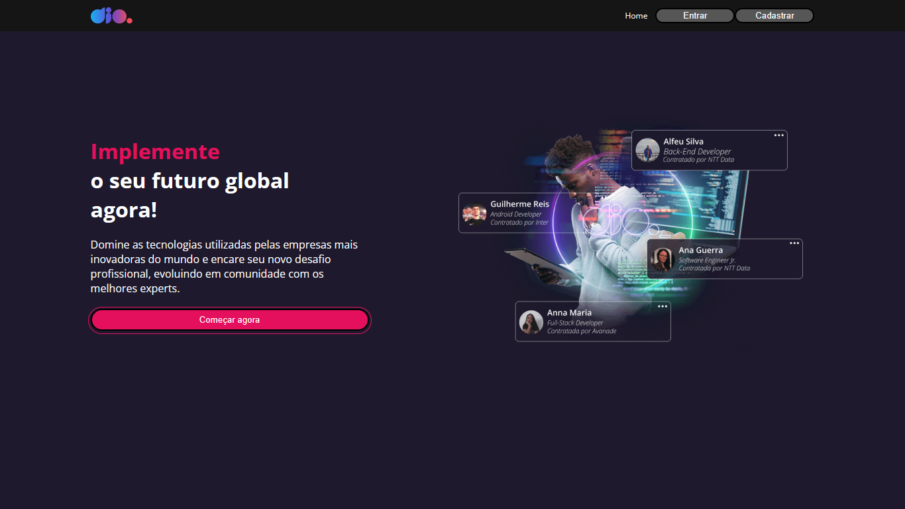

<h1 align="center"> DIO Clone </h1>

Projeto desenvolvido como desafio do bootcamp Orange Tech da DIO.

  <a href="#-tecnologias">Tecnologias</a>&nbsp;&nbsp;&nbsp;|&nbsp;&nbsp;&nbsp;
  <a href="#-projeto">Projeto</a>&nbsp;&nbsp;&nbsp;|&nbsp;&nbsp;&nbsp;
  <a href="#-layout">Layout</a>&nbsp;&nbsp;&nbsp;

 

  

## 🚀 Tecnologias

Esse projeto foi desenvolvido com as seguintes tecnologias:

- HTML e CSS
- JavaScript
- [React](https://pt-br.reactjs.org/)
- [React Router](https://v5.reactrouter.com/)
- [Styled Componentes](https://styled-components.com/)
- [React Icons](https://react-icons.github.io/react-icons/)
- [React Hook Form](https://react-hook-form.com/)
- [Axios](https://axios-http.com/ptbr/docs/intro)
- [Json Server](https://www.npmjs.com/package/json-server)

## 💻 Projeto

Esse projeto tem como objetivo criar um clone das telas de home, login, cadastro e feed da plataforma DIO.

## 🔖 Layout

Você pode visualizar o layout do projeto através [DESSE LINK](https://www.figma.com/file/fvjQQNtqaUdpuNixvCZVav/DIO-CLONE?node-id=1%3A2&t=BOjyln0UWN7ajlrg-0/duplicate). É necessário ter conta no [Figma](https://figma.com) para acessá-lo.

 

---

This project was bootstrapped with [Create React App](https://github.com/facebook/create-react-app).

